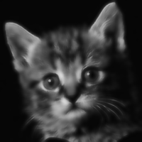
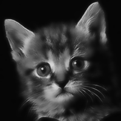
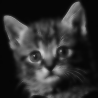
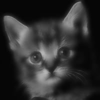
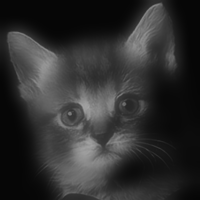

# Fast Guided filter for OpenCV

Fast Guided filter is an edge-preserving smoothing filter like the bilateral filter. It is straightforward to implement and has linear complexity independent of the kernel size. For more details about this filter see[[Guided filte]](http://kaiminghe.com/publications/pami12guidedfilter.pdf) [[Fast Guided filte]](https://arxiv.org/pdf/1505.00996.pdf).


## Usage

The interface consists of one simple function `fastGuidedFilter` and a class `FastGuidedFilter`. If you have multiple images to filter with the same guidance image then use `FastGuidedFilter` class to avoid extra computations on initialization stage. The code supports single-channel and 3-channel (color) guidance images and `CV_8U`, `CV_8S`, `CV_16U`, `CV_16S`, `CV_32S`, `CV_32F` and `CV_64F` data types.


## Examples

These examples are adapted from the [original MATLAB implementation](http://kaiminghe.com/eccv10/fast-guided-filter-code-v1.rar).

### Smoothing

```c++
cv::Mat I = cv::imread("./imgs/cat.png", CV_LOAD_IMAGE_GRAYSCALE);
cv::Mat p = I;

int r = 4; // try r=2, 4, or 8
double eps = 0.2 * 0.2; // try eps=0.1^2, 0.2^2, 0.4^2

eps *= 255 * 255;   // Because the intensity range of our images is [0, 255]
int s  = 1;// try s=1,2      make sure r/s  is an integer
clock_t start_time = clock();
cv::Mat q = fastGuidedFilter(I, p, r, eps,s);
clock_t end_time = clock();
 cout << "Running time is: " << static_cast<double>(end_time - start_time) / CLOCKS_PER_SEC * 1000 << "ms" << endl;
```


- r=2,eps=0.1^2 -0.4^2,s=1  time: 1.7ms




- r=2,eps=0.1^2 -0.4^2,s=2 time: 0.6ms





- r=4,eps=0.1^2 -0.4^2,s=1 time: 1.7ms


- r=4,eps=0.1^2 -0.4^2,s=2 time: 0.6ms




- r=8,eps=0.1^2 -0.4^2,s=1 time: 1.7ms




- r=8,eps=0.1^2 -0.4^2,s=2 time: 0.6ms


### Flash/no-flash denoising

```c++
cv::Mat I = cv::imread("./img_flash/cave-flash.bmp", CV_LOAD_IMAGE_COLOR);
cv::Mat p = cv::imread("./img_flash/cave-noflash.bmp", CV_LOAD_IMAGE_COLOR);

int r = 8;
double eps = 0.02 * 0.02;

eps *= 255 * 255;   // Because the intensity range of our images is [0, 255]

cv::Mat q = guidedFilter(I, p, r, eps);
```

[](http://atilimcetin.com/guided-filter/img_flash/cave-flash.png)
[](http://atilimcetin.com/guided-filter/img_flash/cave-noflash.png)
[](http://atilimcetin.com/guided-filter/img_flash/cave-denoised.png)


### Feathering

```c++
cv::Mat I = cv::imread("./img_feathering/toy.bmp", CV_LOAD_IMAGE_COLOR);
cv::Mat p = cv::imread("./img_feathering/toy-mask.bmp", CV_LOAD_IMAGE_GRAYSCALE);

int r = 60;
double eps = 1e-6;

eps *= 255 * 255;   // Because the intensity range of our images is [0, 255]

cv::Mat q = guidedFilter(I, p, r, eps);
```

[](http://atilimcetin.com/guided-filter/img_feathering/toy-mask.png)
[](http://atilimcetin.com/guided-filter/img_feathering/toy.png)
[](http://atilimcetin.com/guided-filter/img_feathering/toy-feather.png)


### Enhancement

```c++
cv::Mat I = cv::imread("./img_enhancement/tulips.bmp", CV_LOAD_IMAGE_COLOR);
I.convertTo(I, CV_32F, 1.0 / 255.0);

cv::Mat p = I;

int r = 16;
double eps = 0.1 * 0.1;

cv::Mat q = guidedFilter(I, p, r, eps);

cv::Mat I_enhanced = (I - q) * 5 + q;
```

[](http://atilimcetin.com/guided-filter/img_enhancement/tulips.png)
[](http://atilimcetin.com/guided-filter/img_enhancement/tulips-smoothed.png)
[](http://atilimcetin.com/guided-filter/img_enhancement/tulips-enhanced.png)


## License

MIT license.

